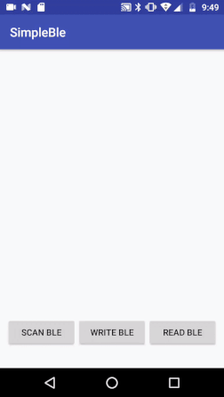

# Android Simple Bluetooth Low Energy (BLE) 



## Introduction

This project is a simple interface to facilitate the use of the native API of Android, Bluetooth le (BLE), which allows basic operations with BLE, since after searching several libraries in different sites have not been adapted to my basic requirements, I hope that this library saves you programming time :)

You can download library files from JCenter or GitHub.

**[LatestVersion is 1.0](https://bintray.com/ederdoski/Maven/simple-ble)**

Add the following in your app's build.gradle file:

```
    repositories {
        jcenter()
    }
```
 **Min SDK version is 18** 
```
    defaultConfig {
        minSdkVersion 18
        ...
    }

    dependencies {
        implementation "com.ederdoski.ble:simpleble:1.0"
    }
```
## AndroidManifest

1) You need to request permissions to access bluetooth and gps
```
    <uses-permission android:name="android.permission.ACCESS_COARSE_LOCATION" />
    <uses-permission android:name="android.permission.ACCESS_FINE_LOCATION" />
    <uses-permission android:name="android.permission.BLUETOOTH" />
    <uses-permission android:name="android.permission.BLUETOOTH_ADMIN" />
    <uses-feature    android:name="android.hardware.bluetooth_le" android:required="false"/>
    <uses-permission android:name="android.permission.BLUETOOTH_PRIVILEGED" tools:ignore="ProtectedPermissions" />
```
PD: for versions >= Android 6 you must request permission in time of execution

## Usage

* **Required**

1) Declares a global variable of type BluetoothLEHelper

```
 BluetoothLEHelper ble;
```

2) Initialize the BluetoothLEHelper class in your onCreate activity

```
 ble = new BluetoothLEHelper(this);
```

3) Once you verify that all the permissions have been accepted and verify that the gps is turned on, scan devices in the area.
```
    if(ble.isReadyForScan()){
        Handler mHandler = new Handler();
        ble.scanLeDevice(true);

        mHandler.postDelayed(() -> {

            //--The scan is over, you should recover the found devices.
            Log.v("Devices found: ", String.valueOf(ble.getListDevices()));

    }, ble.getScanPeriod());
}
```

4) Create an object of type BleCallback, this object will serve you to manage the different events that you can use once you connect the bluetooth with a device.

```
    new BleCallback(){

    @Override
    public void onBleConnectionStateChange(BluetoothGatt gatt, int status, int newState) {
        super.onBleConnectionStateChange(gatt, status, newState);
    
        if (newState == BluetoothProfile.STATE_CONNECTED) {
    	runOnUiThread(() -> Toast.makeText(MainActivity.this, "Connected to GATT server.", Toast.LENGTH_SHORT).show());
        }
    
        if (newState == BluetoothProfile.STATE_DISCONNECTED) {
    	runOnUiThread(() -> Toast.makeText(MainActivity.this, "Disconnected from GATT server.", Toast.LENGTH_SHORT).show());
        }
    }

    @Override
    public void onBleServiceDiscovered(BluetoothGatt gatt, int status) {
        super.onBleServiceDiscovered(gatt, status);
         if (status != BluetoothGatt.GATT_SUCCESS) {
    	Log.e("Ble ServiceDiscovered","onServicesDiscovered received: " + status);
        }
    }

    @Override
    public void onBleCharacteristicChange(BluetoothGatt gatt, BluetoothGattCharacteristic characteristic) {
        super.onBleCharacteristicChange(gatt, characteristic);
         Log.i("BluetoothLEHelper","onCharacteristicChanged Value: " + Arrays.toString(characteristic.getValue()));
    }

    @Override
    public void onBleRead(BluetoothGatt gatt, BluetoothGattCharacteristic characteristic, int status) {
        super.onBleRead(gatt, characteristic, status);

        if (status == BluetoothGatt.GATT_SUCCESS) {
    	 Log.i("TAG", Arrays.toString(characteristic.getValue()));
    	runOnUiThread(() -> Toast.makeText(MainActivity.this, "onCharacteristicRead : "+Arrays.toString(characteristic.getValue()),             Toast.LENGTH_SHORT).show());
        }
    }

    @Override
    public void onBleWrite(BluetoothGatt gatt, BluetoothGattCharacteristic characteristic, int status) {
        super.onBleWrite(gatt, characteristic, status);
        runOnUiThread(() -> Toast.makeText(MainActivity.this, "onCharacteristicWrite Status : " + status, Toast.LENGTH_SHORT).show());
    }
};
```

5) Connect to a found device
```
    ble.connect(BluetoothDevice, bleCallbacks());
```

6) On your OnDestroy, disconnect the device
```
    ble.disconnect();
```

* **Write in Ble devices**

1) You must enter a String with your service, its characteristic and additionally the value to send, (String, Byte [])

```
ble.write(INSERT_YOUR_SERVICE, INSERT_YOUR_CHARACTERISTIC, DATA_TO_SEND);
```

* **Read in Ble devices**

1) You must enter a String with the service and feature that you want to access

```
ble.read(INSERT_YOUR_SERVICE, INSERT_YOUR_CHARACTERISTIC);
```

If you are not very familiar with Java I recommend reviewing the sample application to better understand the structure of the code.

 **When using the ble.write() or ble.read() methods, you should verify that ble.isConnected() == true, or could cause errors in your app** 


## Aditionals Methods

* Returns the state of the connection to the device
```
ble.isConnected();
```
* Check if the Bluetooth and Location permissions have been accepted, and verify that the bluetooth and gps are turned on
```
ble.isReadyForScan();
```
* Returns the current state of the scan
```
ble.isScanning();
```
* Returns a list of devices found in the area
```
ble.getListDevices()
```
* Set the scan time
```
ble.setScanPeriod();
```
* Get the scan time
```
ble.getScanPeriod();
```
* Filter the service scan to get only the desired ones
```
ble.setFilterService();
```

## References

* [Bluetooth LE](https://developer.android.com/guide/topics/connectivity/bluetooth-le) - Bluetooth low energy overview

## License

This code is open-sourced software licensed under the [MIT license.](https://opensource.org/licenses/MIT)
